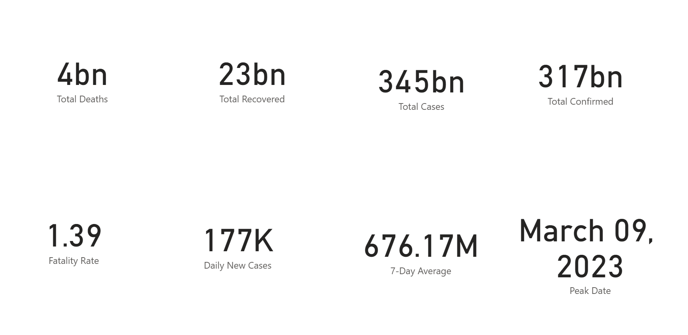
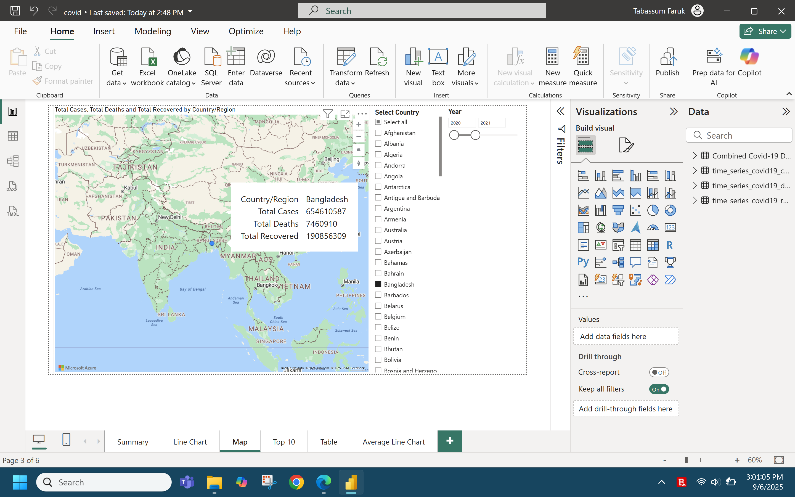
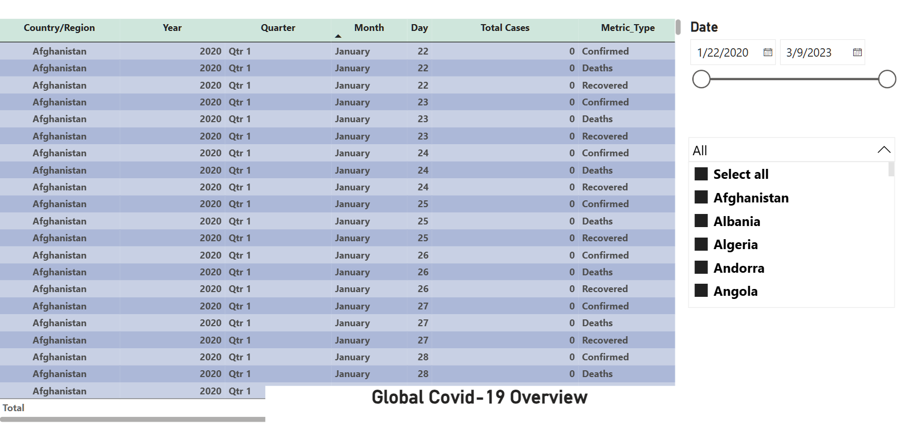
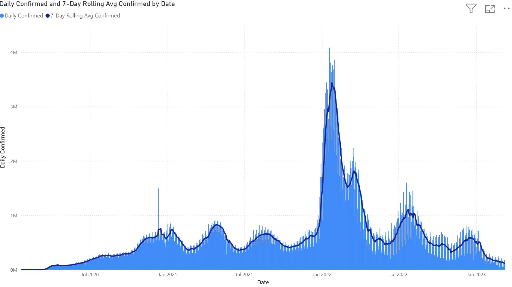

<h1 align="center">COVID-19 Global Impact Dashboard - Power BI Analytics Project</h1>


Developed an interactive Power BI dashboard analyzing global COVID-19 data from Johns Hopkins University. Built multi-page dashboard with advanced DAX calculations, dynamic filtering, and professional visualizations including world maps. Combined three CSV files using Power Query.


Dataset: [COVID-19 Time Series Dataset (JHU CSSE)](https://github.com/CSSEGISandData/COVID-19/tree/master/csse_covid_19_data/csse_covid_19_time_series)

1. Created new measures and displayed them in cards. In the Figure 1, the numbers are shown for each measure.
   ### Key DAX Measures Created:

   **Total Cases:**
   ```
   Total Cases = SUM('Combined Covid-19 Data'[Cases])
   ```

  **Total Confirmed Cases:**
  ```dax
   Total Confirmed = CALCULATE(SUM('Combined Covid-19 Data'[Cases]),'Combined Covid-19 Data'[Metric Type]="Confirmed")
  ```
  **Total Deaths:**
  ```dax
  Total Deaths = CALCULATE(SUM('Combined Covid-19 Data'[Cases]),'Combined Covid-19 Data'[Metric Type]="Deaths")
  ```

  **Total Recovered**
  ```
  Total Recovered = CALCULATE(SUM('Combined Covid-19 Data'[Cases]),'Combined Covid-19 Data'[Metric Type]="Recovered")
  ```
  **Fatality Rate:**
  ```dax
  Fatality Rate = DIVIDE([Total Deaths],[Total Confirmed],0)*100

  ```
  **7 Day Average**
  ```
  7-Day Average = 
AVERAGEX(
    DATESINPERIOD('Combined Covid-19 Data'[Date], MAX('Combined Covid-19 Data'[Date]), -7, DAY),
    [Total Confirmed]
)
  ```
  **Daily New Cases**
  ```
  Daily New Cases = VAR CURRENTDATE = MAX('Combined Covid-19 Data'[Date])
                    VAR PREVIOUSDATE = CURRENTDATE - 1
                    RETURN
                    CALCULATE([Total Confirmed],'Combined Covid-19 Data'[Date]=CURRENTDATE) -
                    CALCULATE([Total Confirmed],'Combined Covid-19 Data'[Date]=PREVIOUSDATE)
  ```
  **Peak Date**
  ```
  Peak Date = 
  FORMAT(
      CALCULATE(
          MAX('Combined Covid-19 Data'[Date]),
          'Combined Covid-19 Data'[Cases] = MAXX('Combined Covid-19 Data', 'Combined Covid-19 Data'[Cases])
      ),
      "MMMM DD, YYYY"
  )
  ```


<p align="center">
  <br>
  <em>Figure 1: COVID-19 Summary</em>
</p>

2. Added a line chart for total deaths, recovered, and confirmed cases.
<p align="center">
  <br>
  <em>Figure 2: A Line Chart Overview</em>
</p>

3. Showed a global overview in Figure 3. This visualizes the global impact of Covid-19 at the glance. We can look at specific countries within a specific date range by moving the slicers.

<p align="center">
  <br>
  <em>Figure 3: Global Overview</em>
</p>

4. Horizontal bar chart displaying the top 10 countries ranked by total confirmed COVID-19 cases.
<p align="center">
  <br>
  <em>Figure 4: Top 10 Countries</em>
</p>

5. A table overview of the Covid-19 impact with interactive filtering abilities.
<p align="center">
  <br>
  <em>Figure 5: Table Overview</em>
</p>

6. This chart displays daily COVID-19 confirmed cases (bars) and their 7-day rolling average (line). The rolling average smooths daily fluctuations to reveal clearer trends over time.
<p align="center">
  <br>
  <em>Figure 5: Daily Confirmed COVID-19 and 7-Day Rolling Average of Confirmed Cases Cases</em>
</p>
